---
# Aeza App

An unofficial Android client for the [Aeza](https://aeza.net) hosting platform,
built with Kotlin and Jetpack Compose. Manage your services, domains, SSH keys
and support tickets, and get background notifications for ticket replies and
product restocks — all from your phone.

## Features

- **Authentication** via Aeza API key (no password stored).
- **Home & Services** — overview of your active services with status and details.
- **Service detail** — inspect a service and toggle **auto-prolongation**.
- **Domains** — view and manage your domains.
- **SSH keys** — add, view and remove keys.
- **Support** — read and reply to tickets in a chat-style screen.
- **Notifications & stock-watch** — get a system notification when a ticket gets
  a reply or when an out-of-stock product becomes available again.
- **Account** — account info and logout.

> Aeza does not offer push (FCM), so notifications are delivered via periodic
> background polling (WorkManager, ~15 min). For reliable delivery the app may
> ask to be excluded from battery optimizations.

## Screenshots

> All screenshots use demo data — no real account information is shown.

<table>
  <tr>
    <td align="center">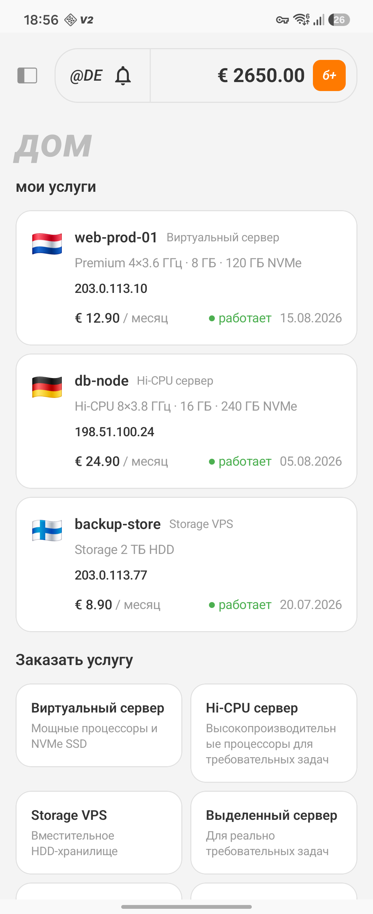<br><sub>Home</sub></td>
    <td align="center">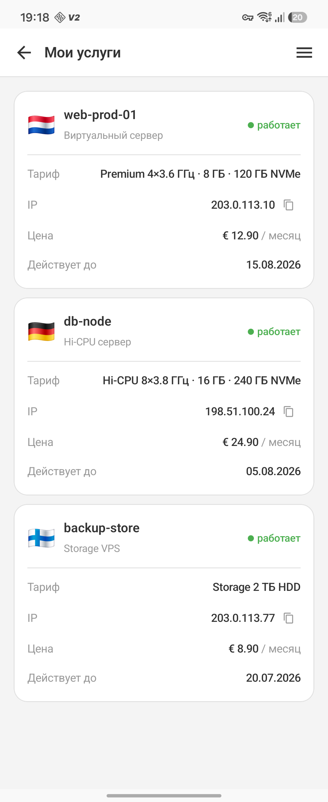<br><sub>Services</sub></td>
    <td align="center">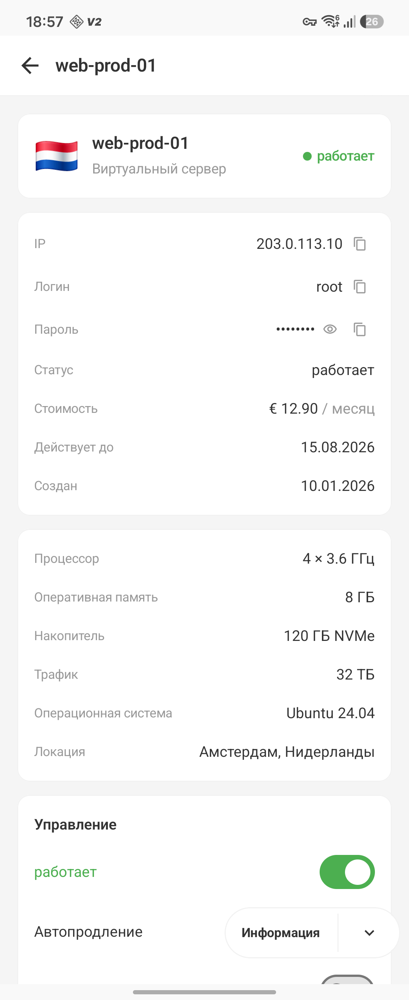<br><sub>Service detail</sub></td>
  </tr>
  <tr>
    <td align="center">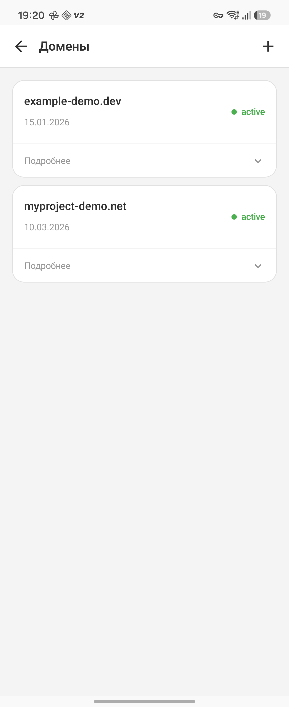<br><sub>Domains</sub></td>
    <td align="center">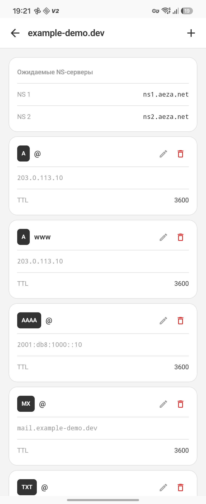<br><sub>DNS records</sub></td>
    <td align="center">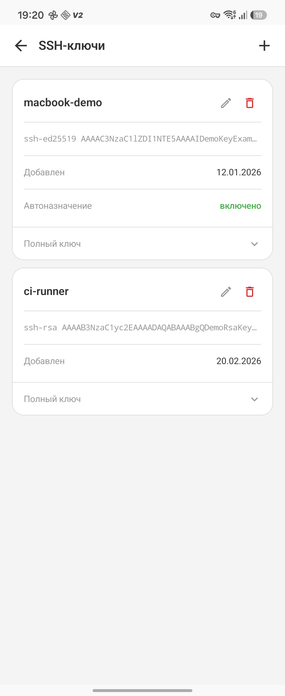<br><sub>SSH keys</sub></td>
  </tr>
  <tr>
    <td align="center">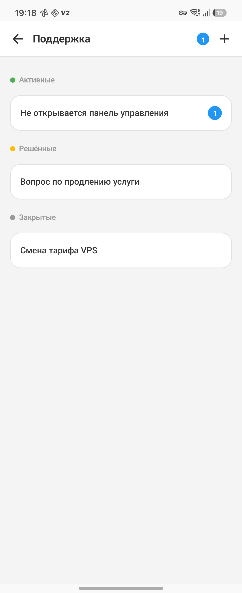<br><sub>Support</sub></td>
    <td align="center">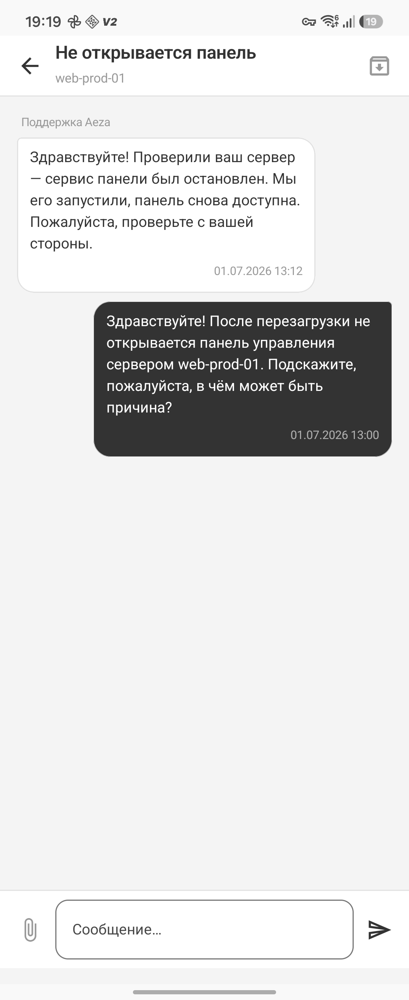<br><sub>Ticket chat</sub></td>
    <td align="center">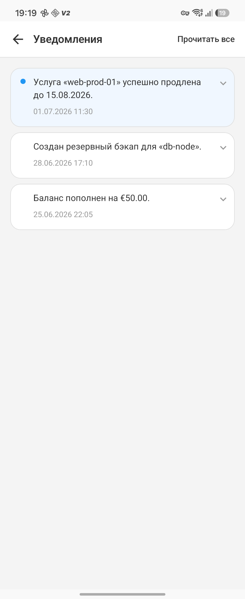<br><sub>Notifications</sub></td>
  </tr>
  <tr>
    <td align="center">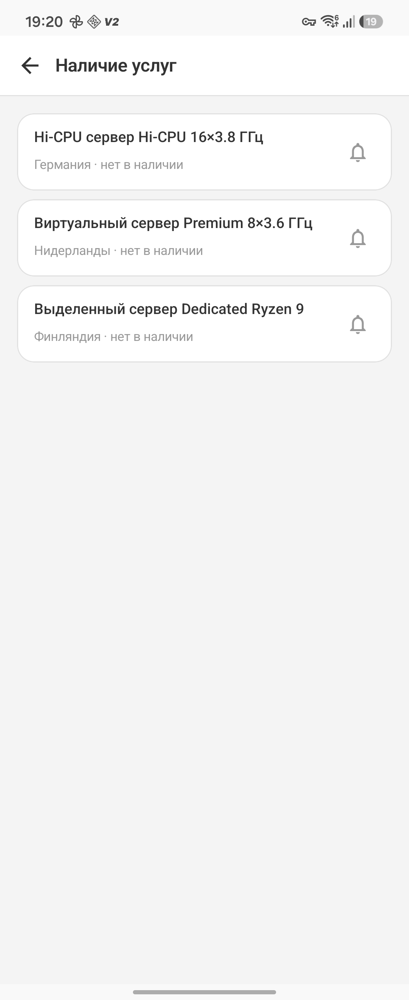<br><sub>Stock-watch</sub></td>
    <td align="center">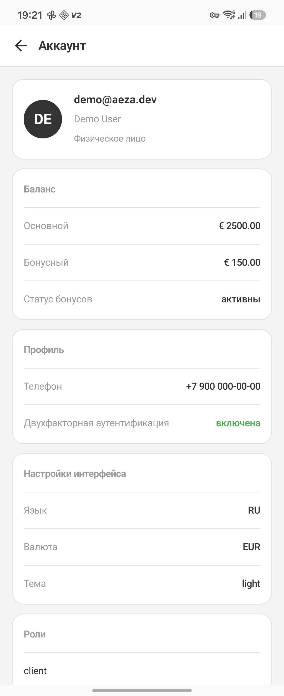<br><sub>Account</sub></td>
    <td align="center">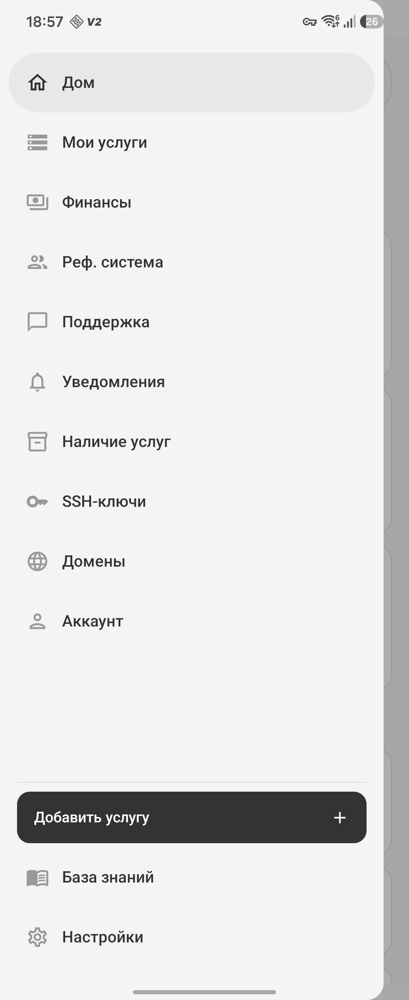<br><sub>Navigation</sub></td>
  </tr>
</table>

## Tech stack

- **Language:** Kotlin
- **UI:** Jetpack Compose + Material 3
- **Architecture:** Clean Architecture (presentation → domain → data), MVVM
- **DI:** Hilt
- **Networking:** Retrofit + OkHttp (Aeza REST API, `https://my.aeza.net/api/v2/`)
- **Navigation:** Navigation Compose (type-safe routes)
- **Background work:** WorkManager
- **Local storage:** SharedPreferences

## Project structure

```
com.shefivan.aezaapp
├── data            # Retrofit ApiService, DTOs, repository impls, local storage
│   └── local       #   ApiKeyStorage, SyncState, StockWatch
├── domain          # Models, repository interfaces, use cases
├── notification    # WorkManager poll worker, notification manager, sync manager
└── presentation    # Compose screens, ViewModels, navigation, UI components
```

## Getting started

### Requirements
- Android Studio (Ladybug or newer recommended)
- JDK 17 (bundled with Android Studio — `jbr`)
- An Android device or emulator

### Setup
1. Clone the repository and open it in Android Studio.
2. Let Gradle sync.
3. Build & run on a device or emulator (▶ Run).

### Getting an API key
Generate a key at **my.aeza.net → Settings → API keys**
(<https://my.aeza.net/settings/apikeys>) and paste it into the login screen.
The key is stored locally in the app's private storage and is used to
authenticate all API requests.

## Build

```bash
./gradlew assembleDebug      # build a debug APK
./gradlew compileDebugKotlin # compile only
```

## Notes

- Requires the POST_NOTIFICATIONS permission (Android 13+) for notifications.
- This is an independent client and is not affiliated with or endorsed by Aeza.
